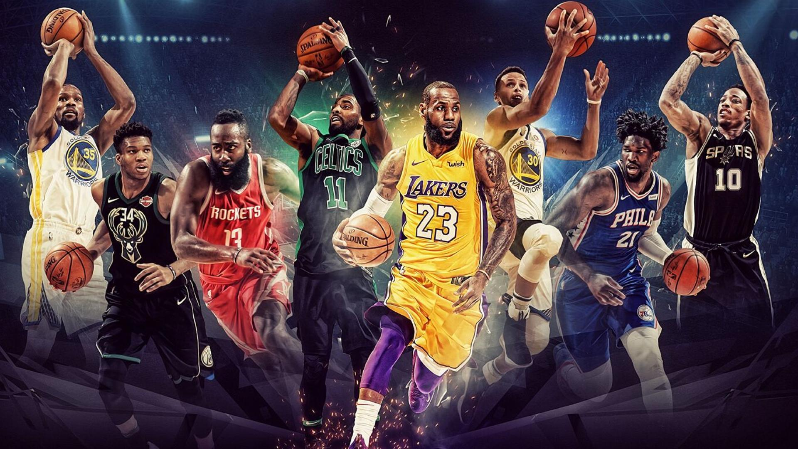
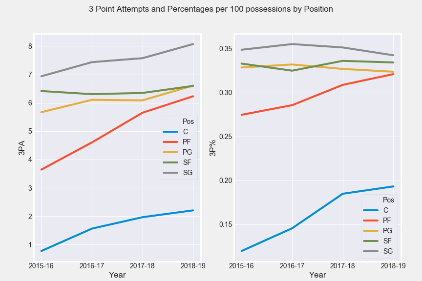
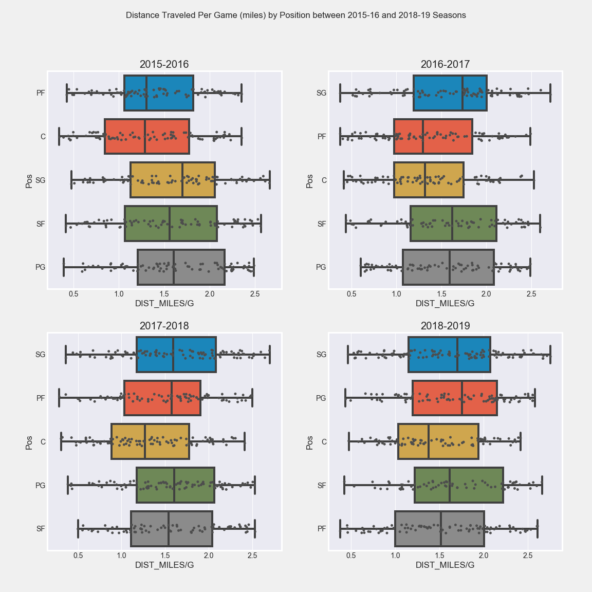
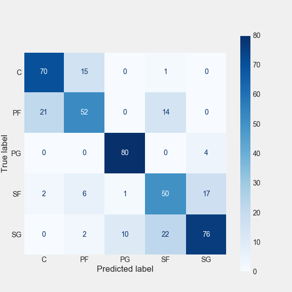
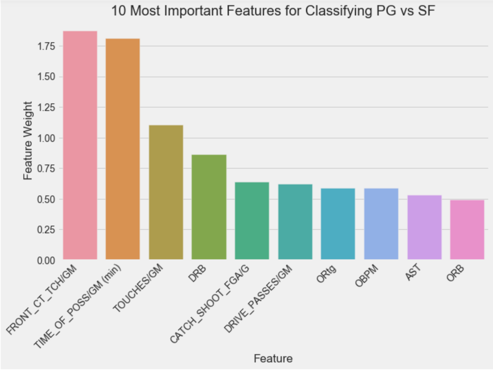
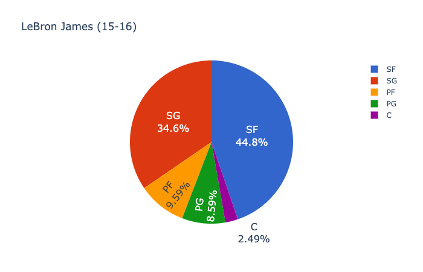

# Building an NBA Position Classifier

# Introduction

Over the 74 year history of the NBA, it has undergone a number of evolutions.  The 24 second shot clock was implemented in beginning in 1954. The key was widened from 6 feet to 12 feet in 1951 and widened again to 16 feet in 1964. The three point line was first used in the 1979-1980 NBA season. For the past few years, much of the conversation surrounding the NBA and its players has been the rise of 'small-ball'. Small ball can be generally described as a play style that emphasizes a faster pace of play, increased three point shooting, and a lineup consisting of four perimeter players (e.g. some combination of point guards, shooting, guards, or small forwards) and one big (e.g. either a power forward or center). Regardless of the rules used to govern the game and the geometry of the court, the game must be played with 5 players for each team and each of those players must play with a specific role and purpose in order for their team to win. 

With the understanding that across all eras of basketball, there are differences in styles of play and roles for each of the 5 positions on the court, we can use a combination of basketball statistics to create a classifier model that will predict a player's position for a given season.

## Business Understanding

### Why build a position classifier model?
With a basic definition for each of the 5 basketball positions (Point Guard - PG, Shooting Guard - SG, 
Small Forward - SF, Power Forward - PF, Center - C) and some game film, it would stand to reason that an individual with limited basketball knowledge could learn to identify the different positions. Certainly those individuals in a professional basketball organization could identify the positions for a variety of different lineups without any trouble at all.  

So why build an NBA position classifier and how would it be useful?

Building a classifier can tell us more than just the position of a player. We would certainly expect that a well tuned model could tell us the position of a player just as we might identify those positions while watching a game. In addition to the model telling us the position we can get the *probabilities* that a player plays at each position. The probabilities can be very useful for the decision makers in an NBA franchise. 

Consider this example: A starting point guard (Player A) plays on a bad team and becomes a free agent at the end of the season. A playoff that fell short of winning it all needs to replace their starting shooting guard (Player B) after that player decided to abruptly retire.  With the position classifier, the front office of the playoff team can see that Player A is 45% point guard, 40% shooting guard, 10% small forward, 3% power forward, and 2% center. Given that this team still has championship aspirations they are apprehensive to start their rookie drafted in the second round. Instead they sign Player A to a contract and have Player A as the starting shooting guard for their team. With the knowledge that Player A can also play the point guard position, the coach of the playoff team can also create lineups where Player A can step in as point guard if the regular starting guard is out for rest or injury.

The position classifier can help inform decisions based around free agency or trades and allow for lineup analysis within the team organization which is very valuable.  Given that decision makers cannot watch every player in every game it is necessary to have a model that can provide quick and efficient analysis of hundreds of players across the league.  It is important to note that the model should be used a tool to *assist* with decision making.  There are many subtle nuances in the game of basketball that cannot be picked up by statistics or cannot be measured.  It should very much be used in conjunction with other information so that you can draw an informed conclusion.  

A well tuned position classifier also has the potential to do the following:
 - Position analysis for NBA Draft prospects given that certain players may have to learn to play a new position in the NBA
 - Offer statistical method to evaluate players for end-of-year season awards. Media members vote for end of season awards and those votes will always be subject to bias. The current structure of the All NBA awards require each All NBA team to have two guards, two forwards, and a center. If we can understand the probabilities of each position associated with a player then we can better compare players when voting for these teams and hopefully create the fairest teams. All NBA selections can affect the value of player contracts so eliminating bias by using a model has huge implications.
 
 In this analysiss we will take advantage of the CRISP-DM methodology wherin we iterate through different models with the data.  We will evaluate each model to see which is the most accurate.  We will then look at transforming and scaling the data to see if we can improve upon model performance.
 
 ## Exploratory Data Analysis
 
 The exploratory data analysis will focus on looking at various statistics by position and by year.  This will inform us as to wheter or not a metric may be a good indicator of position.  It will also allow us to observe the NBA as whole and see if any trends have been established.
 
 For example we will look at the number of 3 point attempts by position over the course of a season as well as distance traveled by a player.
 
 
 
 
 
 ## Model Building
 
 In this project I ended up using a Support Vector Machine with a linear kernel on log transformed data using sklearn's `StandardScaler`.
 
 The model was 74% accurate on testing data and had a cross validation training accuracy of 74.1%. This accuracy did not account for the fact that it would be acceptable to class some players as multiple positions.
 
 
 I also took a look at the top 10 most important features for each combination of two positions. For example, the 10 most important features in classifying a point guard versus a small forward is shown below:
 
 
 
 Using the `.predict_proba()` method I created a `Player()` class with a `.position_breakdown()` method which produced a pie chart of the position probabilities for a player in a given year.
 A position breakdown chart has many applications including draft analysis, player comparisons, and lineup analysis on a game by game basis.
 
 
 
 # Conclusion
 
 Amongst all position comparisons, touches (either front court or overall) and time of possession are significant in determining position. Defensive rebounding is the most frequent defensive indicator. Drives per game and catch and shoot field goal attempts per game are the most frequent offensive indicators.

Small forwards and power forwards are the most difficult positions to classify, however this implies that they are the most hybrid positions in the test set.

With respect to the 2016 NBA Finals, the Golden State Warriors have a glaring lack of positional diversity for their center Andrew Bogut. Bogut's next best position is PF but it only has a probability of 2.76%. The position breakdowns for the other players provide us with some confidence that they may be able to play multiple positions. On the other hand, Kyrie Irving has the least positional diversity amongst the Cleveland starters, however his second best position of shooting guard is 14.8%. The Warriors ending up losing this series in 7 games to the Cavaliers. Although Andrew Bogut was injured in Game 5 and unable to participate in the remainder of the series, the position breakdown indicates that it would be to Cleveland's advantage to use a more mobile center (i.e. Tristan Thompson or Kevin Love) that could create a defensive mismatch for Bogut.

## Future Work

If we want to use this model as a tool for the NBA Draft then we need to collect college basketball data so that we can predict a college player's NBA position! Unfortunately we don't have the same access to robust resources for college basketball tracking data. It's also important to note that not all colleges have installed SportVU cameras in their arena meaning we would have build an algorithm to classify different types of shots based on game footage or manually classify those shots which would take an incredibly long time.

We would also want to use the `Player` class and `.position_breakdown()` method to perform some exploratory data analysis on All NBA teams. All NBA teams are voted on by media members and ideally we would like to reduce or eliminate their bias. See the position breakdowns would allow us to compare like players and hopefully have All NBA teams that are fair.

The same exercise we have done above can (and should) be done on WNBA data!
